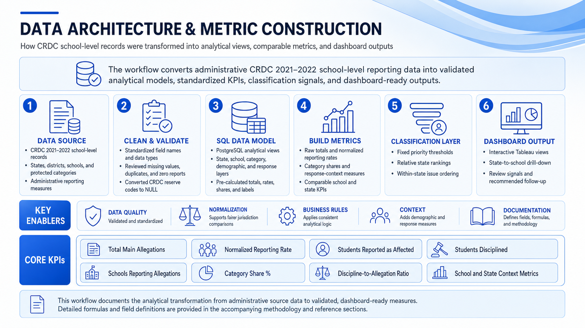
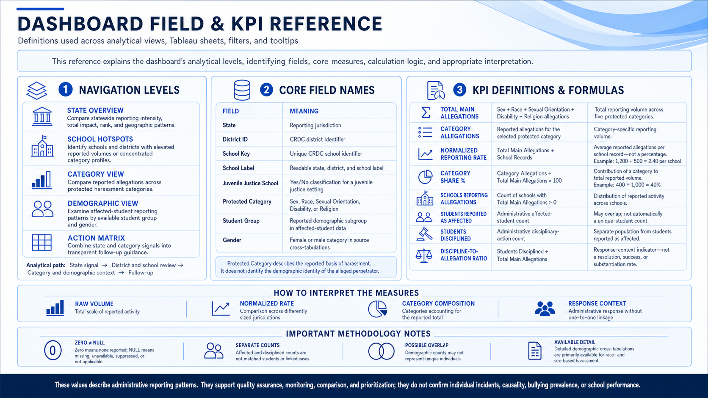
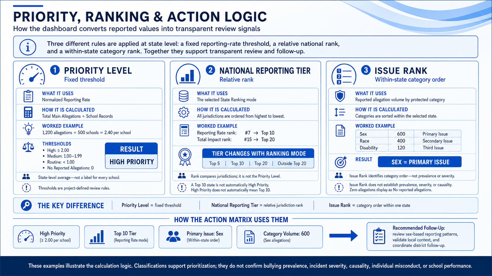

<div align="center">

# 🏫 CRDC School Bullying Dashboard

### A decision-support dashboard for state education oversight

`CRDC 2021–22` · `Python` · `PostgreSQL` · `Tableau`

✅ **Completed capstone project**

**Identify reporting signals · Examine context · Prioritize follow-up**

**Yoldas Erdem** · Data Analytics & AI Bootcamp Capstone · 2026

</div>

---

## 🧭 Quick navigation

|     | Section                                       | What it covers                          |
| --- | --------------------------------------------- | --------------------------------------- |
| 🎯  | [Project purpose](#project-purpose)           | Problem, analytical question, and scope |
| 👥  | [Intended users](#intended-users)             | State oversight and local follow-up     |
| 🏗️  | [Data architecture](#data-architecture)       | CRDC → ETL → SQL → Tableau              |
| 🗃️  | [Dataset](#dataset)                           | Source, scope, and protected categories |
| 📊  | [Core KPIs](#core-kpis)                       | Formulas, examples, and interpretation  |
| 🧭  | [Classification logic](#classification-logic) | Priority, national tier, and issue rank |
| 🖥️  | [Dashboard workflow](#dashboard-workflow)     | State → school → context → action       |
| 🔎  | [Key findings](#key-findings)                 | Main analytical observations            |
| ⚠️  | [Limitations](#limitations)                   | Reporting caveats and responsible use   |
| 📚  | [Documentation](#documentation)               | README, report, and visual references   |

## ✨ Project at a glance

| 🏫 **98,010**  |     🗂️ **159**     |   🌎 **52**   |  🏢 **17,704**   |        ⚖️ **882**        |
| :------------: | :----------------: | :-----------: | :--------------: | :----------------------: |
| School records | Original variables | Jurisdictions | School districts | Juvenile justice schools |

---

<a id="project-purpose"></a>

## 🎯 Project purpose

State education leaders oversee thousands of schools, but raw allegation totals alone do not show where attention should be focused. Larger jurisdictions naturally produce higher totals, administrative reporting practices differ, and higher reporting does not automatically indicate a less safe school environment.

This project transforms CRDC school-level reporting records into a transparent oversight workflow that helps leaders:

- identify states, districts, and schools with elevated reporting signals;
- compare total impact with normalized reporting intensity;
- examine which protected categories and student groups are most represented;
- distinguish threshold-based priority from relative national rank;
- translate analytical signals into structured, rule-based follow-up guidance.

### Key analytical question

> **Where do reported harassment and bullying patterns require attention, which categories and groups are most represented in those patterns, and where should state leaders prioritize deeper review?**

The dashboard is designed to support screening, prioritization, and quality assurance. It is not an incident-investigation, case-management, or predictive system.

---

<a id="intended-users"></a>

## 👥 Intended users and operating model

The primary audience is a **State Education Agency civil-rights, school-climate, student-support, accountability, or quality-assurance team**. Federal or national analysts may use the state comparisons as an oversight view, while district and school leaders provide the deeper local investigation.

The intended workflow is:

1. Detect an unusual state, district, category, demographic, or school-level reporting signal.
2. Compare raw volume with normalized reporting intensity.
3. Inspect category, demographic, school, and response context.
4. Use the Action Matrix to prioritize a follow-up area.
5. Hand the signal to district and school teams for local validation and investigation.
6. Reassess the pattern in future reporting cycles.

### 🔄 Quality-assurance cycle

> **Identify the signal → examine the context → prioritize the next follow-up step.**

```text
🔍 Detect a signal
        ↓
📊 Compare metrics
        ↓
🧩 Inspect context
        ↓
🎯 Prioritize follow-up
        ↓
🏫 District and school investigation
        ↓
🔁 Reassess in the next reporting cycle
```

---

<a id="data-architecture"></a>

## 🏗️ Data architecture and metric construction

The project uses a layered analytical architecture:

1. **CRDC source data** — school-level administrative reporting records.
2. **Cleaning and validation** — standardized names and data types, reserve-code handling, identifier preservation, and quality checks.
3. **PostgreSQL analytical model** — purpose-built state, school, category, demographic, response, and action views.
4. **Metric construction** — raw totals, normalized rates, category shares, reporting coverage, and response-context measures.
5. **Classification layer** — project-defined priority thresholds, relative rankings, and within-state category order.
6. **Tableau output** — interactive oversight, investigation, and action dashboards.



_Figure 1. Data Architecture & Metric Construction._

### 💾 Why use SQL views?

Stable business logic is centralized in PostgreSQL rather than recreated independently in every Tableau sheet. The SQL views:

- define the grain of each analytical output;
- calculate KPIs consistently;
- reshape protected-category data into analysis-ready rows;
- generate ranks, labels, shares, and classification fields;
- reduce duplicated calculations in Tableau;
- make the recommendation logic transparent and auditable.

Tableau is then used primarily for visualization, filtering, parameters, tooltips, and interactive investigation.

---

<a id="dataset"></a>

## 🗃️ Dataset & official CRDC source

**Source:** [U.S. Department of Education — Civil Rights Data Collection](https://civilrightsdata.ed.gov/data)

**Collection:** Civil Rights Data Collection (CRDC) 2021–22  
**Unit of analysis:** Administrative school-level records

The official CRDC data downloads, file documentation, and supporting reference materials are available from the source page above. They are linked rather than duplicated in this repository.

### 📌 Project data scope

| Item                      |  Scope |
| ------------------------- | -----: |
| School records            | 98,010 |
| Original variables        |    159 |
| State-level jurisdictions |     52 |
| School districts          | 17,704 |
| Juvenile justice schools  |    882 |

The analytical scope includes:

- school, district, and jurisdiction identifiers;
- reported harassment and bullying allegations;
- five protected harassment categories;
- students reported as affected;
- students receiving disciplinary action;
- available demographic cross-tabulations;
- school and jurisdiction context.

### 🧩 Protected categories

The five main allegation categories are:

- Sex
- Race
- Sexual Orientation
- Disability
- Religion

Detailed demographic cross-tabulations are available primarily for race- and sex-based harassment. The dataset does not provide the student-level incident detail required to answer questions involving exact ages, grades, repeated victimization, incident location, or case outcomes.

---

## 🧹 ETL and data-quality decisions

The Python/Pandas ETL process:

- selected fields relevant to allegations, affected students, disciplinary response, demographics, and school context;
- renamed technical CRDC variables into readable analytical field names;
- preserved leading zeros in district and school identifiers;
- standardized data types;
- checked duplicates and missing values;
- converted CRDC reserve codes (`-3`, `-4`, `-5`, `-6`, `-9`, `-12`, `-13`) to `NULL`;
- preserved valid zero reports separately from missing information;
- exported a clean analytical dataset for PostgreSQL and Tableau.

### 0️⃣ Zero and NULL are different

- `0` means no value was reported for the relevant measure.
- `NULL` means missing, unavailable, suppressed, invalid, or not applicable.

This distinction prevents unavailable values from being interpreted as confirmed zero activity.

Where `COALESCE` is used in an aggregate formula, it prevents SQL NULL propagation so available category values can still be summed. The original cleaned fields retain the missing-data distinction.

---

## 🧱 Analytical views and grain

Each SQL view has a defined grain so measures are not unintentionally duplicated.

| Analytical view       | One row represents                                         |
| --------------------- | ---------------------------------------------------------- |
| State overview        | One jurisdiction                                           |
| School hotspot matrix | One school and protected category                          |
| Category analysis     | One protected-category aggregate                           |
| Demographic analysis  | One state, category, student group, and gender combination |
| Action matrix         | One state and ranked protected category                    |

Grain matters because a state-level measure repeated across category or demographic rows must not be summed as though every row contains a new state value. Pre-calculated contextual measures therefore use non-additive aggregations such as `MIN`, `MAX`, or `ATTR` when appropriate in Tableau.

---

<a id="core-kpis"></a>

## 📊 Core KPIs

| KPI                                | Construction                                                               | Business meaning                                                           |
| ---------------------------------- | -------------------------------------------------------------------------- | -------------------------------------------------------------------------- |
| **Total Main Allegations**         | Sum of Sex, Race, Sexual Orientation, Disability, and Religion allegations | Total administrative reporting volume across the five protected categories |
| **Category Allegations**           | Reported allegations for the selected category                             | Category-specific reporting volume                                         |
| **Normalized Reporting Rate**      | Total Main Allegations ÷ School Records                                    | Average reported allegations per school record; not a percentage           |
| **Category Share %**               | Category Allegations ÷ Total Main Allegations × 100                        | Contribution of a protected category to the total reported volume          |
| **Schools Reporting Allegations**  | Count of schools where Total Main Allegations > 0                          | Distribution of reported activity across schools                           |
| **Students Reported as Affected**  | Administrative affected-student count                                      | Reported impact context; may contain overlapping counts                    |
| **Students Disciplined**           | Administrative disciplinary-action count                                   | Separate administrative response population                                |
| **Discipline-to-Allegation Ratio** | Students Disciplined ÷ Total Main Allegations                              | Response-context indicator; not a resolution or success rate               |

### 🧮 Example: normalized reporting rate

If a jurisdiction reports 1,200 total allegations across 500 school records:

```text
1,200 ÷ 500 = 2.40 reported allegations per school
```

The result is **2.40 allegations per school**, not 2.40%.

### 🥧 Example: category share

If one category contains 400 of a jurisdiction's 1,000 total allegations:

```text
400 ÷ 1,000 × 100 = 40%
```

This means the category represents 40% of the five-category allegation total. It does not mean that 40% of students experienced that form of harassment.

---

<a id="classification-logic"></a>

## 🧭 Classification, ranking, and action logic

The dashboard uses three complementary systems. Each answers a different question.

### 1️⃣ Priority Level — fixed threshold

Priority Level compares the state Normalized Reporting Rate with project-defined review thresholds:

| Priority Level          |  State normalized reporting rate |
| ----------------------- | -------------------------------: |
| High Priority           |    ≥ 2.00 allegations per school |
| Medium Priority         | 1.00–1.99 allegations per school |
| Routine Monitoring      |     < 1.00 allegation per school |
| No Reported Allegations |                                0 |

These are capstone business rules created to translate a continuous metric into understandable monitoring categories. They are not official CRDC or government policy thresholds.

### 2️⃣ National Reporting Tier — relative rank

National Reporting Tier compares a jurisdiction with other jurisdictions using the selected ranking mode:

- Top 5
- Top 10
- Top 20
- Outside Top 20

The ranking mode can be switched between:

- **Highest Reporting Rate** — compares allegations per school;
- **Highest Total Impact** — compares total reported allegations.

A jurisdiction can therefore be High Priority without being Top 5, or Top 10 without meeting the High Priority threshold.

### 3️⃣ Issue Rank — within-state category order

Issue Rank sorts protected categories by reported allegation volume inside each state:

- Primary Issue
- Secondary Issue
- Third Issue

For example, if an illustrative state reports:

| Protected category | Allegations | Issue Rank      |
| ------------------ | ----------: | --------------- |
| Sex                |         600 | Primary Issue   |
| Race               |         400 | Secondary Issue |
| Disability         |         120 | Third Issue     |

Issue Rank describes category order. It does not establish prevalence, severity, or causality. Categories with zero allegations display as **No reported allegations** rather than being presented as an active issue.



_Figure 2. Priority, Ranking & Action Logic._

### 🎯 Action Matrix

The Action Matrix combines:

- Priority Level;
- National Reporting Tier;
- Issue Rank;
- reported category volume;
- category-specific business rules.

The resulting recommendation is a transparent starting point for state oversight. It can suggest reporting validation, category-specific prevention, response review, district engagement, or continued monitoring.

The recommendation engine is **rule-based, not artificial intelligence or machine learning**. Each output can be traced to a defined metric or business rule. Recommendations support review and prioritization; they do not prescribe policy.

---

<a id="dashboard-workflow"></a>

## 🖥️ Tableau dashboard workflow

### Dashboard journey

> 🌎 **State overview** → 🏫 **School hotspots** → 🧩 **Category context** → 👥 **Demographic context** → 🎯 **Recommended follow-up**

The Tableau Story follows a decision-support sequence:

### 🌎 1. State Reporting Overview

Compares geographic reporting patterns and ranks jurisdictions by either normalized reporting intensity or total impact.

### 🏫 2. School Reporting Hotspots

Drills from a selected state into districts and schools. Rows are sorted by each school's Total Main Allegations, while cell colour represents the allegation count for an individual protected category.

This distinction is important: the darkest individual cell is not always the highest-total school because one school may have reports distributed across several categories.

### 🧩 3. Category and Demographic Context

Compares the five protected categories and shows which available affected-student groups are most represented in administrative reporting.

### 👥 4. Detailed Demographic Hotspots

Compares affected-student counts across states, demographic groups, and gender for the detailed race- and sex-based cross-tabulations.

Race-based harassment is not limited to minority student groups. The protected category represents the reported basis of harassment, so White students may also be reported as affected by race-based harassment.

### 🎯 5. Priority and Recommended Follow-Up

Combines the previous signals into a state and category action matrix with transparent monitoring and follow-up guidance.

## 🧠 How to read the dashboard

1. **Filter** — select a jurisdiction, district, school, protected category, demographic group, or institutional context.
2. **Compare** — review raw totals alongside normalized measures.
3. **Inspect context** — use tooltips, demographic patterns, category shares, and response measures.
4. **Prioritize follow-up** — use recommendations to identify where deeper review should begin.

The tooltips preserve detail without overcrowding the visualizations. Depending on the sheet, they include:

- full school and district identifiers;
- category allegation volume and share;
- school or state totals;
- Issue Rank;
- affected-student and disciplinary-action context;
- priority and national tier;
- recommended follow-up;
- interpretation and methodology notes.



_Figure 3. Dashboard Field & KPI Reference._

---

<a id="key-findings"></a>

## 🔎 Key findings

The completed analysis indicates that:

- reporting intensity and total reporting volume vary substantially across jurisdictions;
- large jurisdictions can dominate total-impact rankings while smaller jurisdictions can rank highly on allegations per school;
- sex- and race-based allegations account for the largest reported volumes in the five-category analysis;
- school-level reporting profiles may be concentrated in one category or distributed across several categories;
- multiple high-reporting schools can appear within one district, creating a district-level cluster that warrants coordinated review;
- demographic patterns vary across jurisdictions and should be examined without assumptions about which groups may be affected;
- higher reporting should be treated as a signal for review rather than proof of poorer school climate.

The principal analytical contribution is not identifying which state or school is "worst." It is helping leaders determine where deeper validation, investigation, and resource prioritization should begin.

---

<a id="limitations"></a>

## ⚠️ Interpretation and limitations

### 📣 Administrative reporting is not confirmed prevalence

Reported allegation counts may be influenced by:

- incident levels;
- reporting awareness;
- access to reporting channels;
- documentation quality;
- local definitions and administrative practices;
- underreporting or incomplete reporting.

Higher values may reflect more reported incidents, stronger reporting systems, or both.

### 🔗 Measures are not linked one-to-one

Reported allegations, students reported as affected, and students disciplined describe different administrative measures and populations. They should not be interpreted as matched cases.

The Discipline-to-Allegation Ratio is therefore not:

- a resolution rate;
- a substantiation rate;
- a success rate;
- proof that every allegation did or did not result in discipline.

### 👥 Affected-student counts may overlap

The demographic fields do not necessarily represent unique students. A student may appear in more than one reported category or subgroup.

### 🧭 No causal claims

The project is descriptive and decision-support oriented. It identifies patterns and review signals but cannot establish why those patterns occur.

### 🏫 Local investigation remains necessary

Questions involving age, grade, incident location, repeated involvement, complaint handling, individual outcomes, school-climate surveys, or case-level support require additional district and school records.

---

## 🛠️ Technology stack

| Technology       | Purpose                                                                       |
| ---------------- | ----------------------------------------------------------------------------- |
| Python           | Data preparation and validation                                               |
| Pandas           | ETL and data transformation                                                   |
| Jupyter Notebook | Exploration and pipeline development                                          |
| PostgreSQL       | Analytical database and semantic layer                                        |
| SQL              | Aggregation, reshaping, ranking, classifications, and recommendation rules    |
| DBeaver          | Database development and validation                                           |
| Tableau          | Interactive dashboards, filters, parameters, tooltips, and presentation story |
| Git and GitHub   | Version control and project documentation                                     |

---

## 📂 Project structure

```text
School_Bullying_Capstone/
├── data/
│   ├── raw/
│   └── processed/
├── notebooks/
│   ├── 01_Data_Exploration.ipynb
│   └── 02_ETL_Pipeline.ipynb
├── sql/
├── tableau/
├── documentation/
│   ├── Images/
│   ├── appendix/
│   └── reports/
├── presentation/
└── README.md
```

The original CRDC source dataset is not included in the repository. Download it from the U.S. Department of Education and place the source archive in `data/raw/` before running the ETL workflow.

---

<a id="documentation"></a>

## 📚 Documentation package

The final documentation is organized into three complementary resources:

1. **README** — project purpose, architecture, dashboard workflow, findings, and limitations.
2. **Final Analysis Report** — consolidated analytical narrative, methodology, findings, and limitations.
3. **Appendix resources** — the project data dictionary and the original CRDC appendix workbook used during field selection.

Official CRDC data and source documentation can be obtained from the [Civil Rights Data Collection data page](https://civilrightsdata.ed.gov/data).

Supporting documentation graphics:

- Data Architecture & Metric Construction
- Priority, Ranking & Action Logic
- Dashboard Field & KPI Reference

---

## ✅ Project status

| Phase                          | Status          |
| ------------------------------ | --------------- |
| Project structure              | ✅ Completed    |
| Data exploration               | ✅ Completed    |
| ETL and cleaning               | ✅ Completed    |
| PostgreSQL database            | ✅ Completed    |
| SQL analytical views           | ✅ Completed    |
| KPI and classification logic   | ✅ Completed    |
| Tableau worksheets             | ✅ Completed    |
| Interactive dashboards         | ✅ Completed    |
| Tableau Story and presentation | ✅ Completed    |
| Final documentation            | 🔄 Final review |

---

## 🚀 Future development

Future versions could:

- add multiple CRDC reporting years for trend analysis;
- include student enrollment for additional per-capita comparisons;
- incorporate school and district contextual variables;
- validate thresholds with domain stakeholders;
- add statistical benchmarking or uncertainty measures;
- test the dashboard with state and district users;
- expand demographic analysis when more granular cross-tabulations are available.

---

## 🏁 Final takeaway

> **The dashboard translates administrative reporting data into a structured quality-assurance workflow: identify the signal, examine the context, and prioritize the next follow-up step.**

It supports deeper review without treating higher reporting as proof of poorer school performance.

---

## 👤 Author

**Yoldas Erdem**  
Data Analytics & AI Bootcamp Capstone Project  
2026
