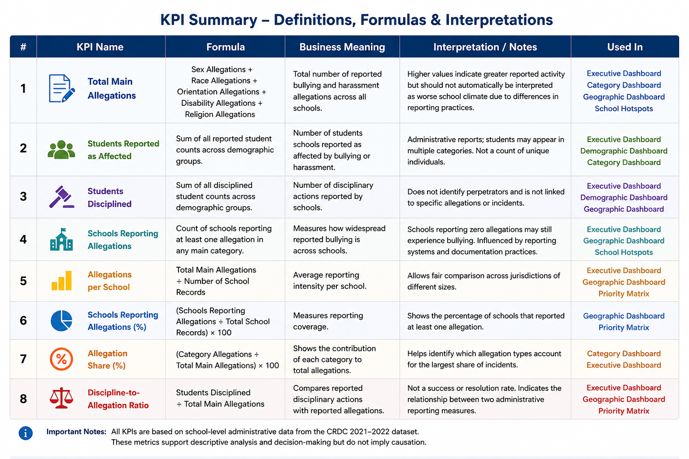

# KPI Definitions

## Purpose

This document defines the key performance indicators (KPIs) used throughout the School Bullying Analysis project.

The purpose of these KPIs is to ensure that all metrics displayed in SQL queries, Tableau dashboards, and the final report are interpreted consistently.

Unless otherwise stated, all metrics are calculated using the cleaned CRDC 2021–2022 analytical dataset.

---

## KPI Summary

---

# KPI Definitions

## 1. Total Main Allegations

**Formula**

Total of:

- Sex-based allegations
- Race-based allegations
- Sexual orientation allegations
- Disability-based allegations
- Religion-based allegations

**Business Meaning**

Represents the total number of reported bullying and harassment allegations recorded across all schools.

**Interpretation**

Higher values indicate greater reported bullying activity but should not automatically be interpreted as worse school climate because reporting practices differ across jurisdictions.

---

## 2. Students Reported as Affected

**Formula**

Sum of all reported student counts across the major demographic reporting groups.

**Business Meaning**

Represents the number of students schools reported as affected by bullying or harassment.

**Interpretation**

These values describe administrative reports rather than verified individual victim records.

Students may appear in multiple reporting categories.

---

## 3. Students Disciplined

**Formula**

Sum of all disciplined student counts across the major demographic reporting groups.

**Business Meaning**

Represents disciplinary actions reported by schools in relation to bullying and harassment incidents.

**Interpretation**

These values do not identify perpetrators.

The dataset does not link disciplined students to specific allegations or individual incidents.

---

## 4. Schools Reporting Allegations

**Formula**

Count of schools reporting at least one allegation in any of the five primary allegation categories.

**Business Meaning**

Measures how widespread reported bullying is across schools.

**Interpretation**

Schools reporting zero allegations should not automatically be interpreted as schools with no bullying.

Differences in reporting systems, documentation practices, and administrative processes may influence this metric.

---

# Normalized KPIs

The following KPIs were created to improve comparability across jurisdictions.

Raw counts alone can be misleading because larger states naturally contain more schools.

---

## 5. Allegations per School

**Formula**

Total Main Allegations ÷ Number of School Records

**Business Meaning**

Measures average reporting intensity per school.

**Why it was created**

Allows comparisons between jurisdictions of different sizes.

**Interpretation**

Higher values indicate that schools within a jurisdiction report more allegations on average.

This metric should be interpreted alongside total allegations rather than replacing them.

---

## 6. Schools Reporting Allegations (%)

**Formula**

Schools Reporting Allegations ÷ Total School Records × 100

**Business Meaning**

Measures reporting coverage.

**Interpretation**

Shows the proportion of schools within a jurisdiction that reported at least one allegation.

Higher percentages indicate broader reporting across schools.

---

## 7. Allegation Share (%)

**Formula**

Category Allegations ÷ Total Main Allegations × 100

**Business Meaning**

Shows the contribution of each allegation category to overall reported bullying.

**Interpretation**

Useful for identifying which categories account for the largest share of reported incidents.

---

## 8. Discipline-to-Allegation Ratio

**Formula**

Students Disciplined ÷ Total Main Allegations

**Business Meaning**

Compares reported disciplinary actions with reported allegations.

**Interpretation**

This metric should not be interpreted as a success rate or resolution rate.

The CRDC dataset does not link allegations directly to disciplinary outcomes.

Instead, the ratio provides a high-level comparison between two related administrative reporting measures.

---

# Analytical Classifications

Several business-oriented classifications were created specifically for Tableau dashboards.

---

## Priority Level

States and schools are categorized into priority groups based on reporting intensity.

Categories include:

- Highest Priority
- High Priority
- Response Review
- High Reporting Coverage
- Monitor

These labels support executive dashboard filtering and prioritization.

---

## Suggested Action

Each priority category is accompanied by a rule-based recommendation.

Examples include:

- Prioritize prevention resources
- Review reporting consistency
- Investigate unusually high reporting intensity
- Continue routine monitoring

These recommendations are intended to support discussion rather than prescribe policy decisions.

---

# Important Interpretation Notes

The CRDC dataset contains administrative school-level reporting data.

It does **not** contain:

- Individual incident records
- Individual student histories
- Cause-and-effect relationships
- Verified offender-victim links

Therefore:

- Correlation does not imply causation.
- Higher reporting does not necessarily indicate poorer school climate.
- Higher disciplinary counts do not demonstrate that one demographic group commits more bullying.
- Raw totals should always be interpreted alongside normalized metrics.

---

# Relationship Between the KPIs

The project follows a layered analytical approach.

Raw Measures

↓

Normalized Measures

↓

Comparative Analysis

↓

Business Insights

↓

Executive Recommendations

This approach allows descriptive statistics to be transformed into decision-support metrics suitable for interactive business intelligence dashboards.
